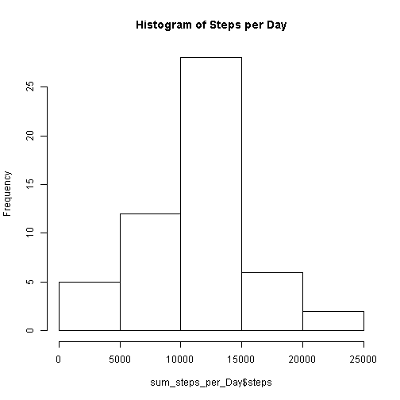
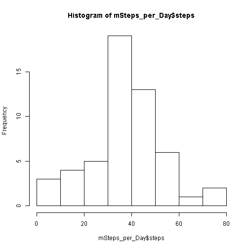
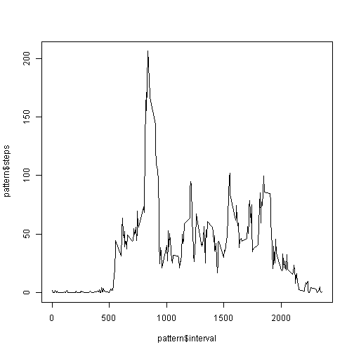

# Reproducible Research: Peer Assessment 1
This assignment makes use of data from a personal activity monitoring device.
This device collects data at 5 minute intervals through out the day. The data
consists of two months of data from an anonymous individual collected during
the months of October and November, 2012 and include the number of steps
taken in 5 minute intervals each day.

## Loading and preprocessing the data
The data file was loaded with read.csv with no parameters.  A summary() and str() shows the dataset includes the following columns:  steps (int), date (Factor) and interval(int). There were 17568 observations, each day broken down in 288 five (5) minute intervals, totaling 1440 minutes (288 * 5) per day.   


```r
setwd("C:\\Users\\srobin\\Documents\\GitHub\\RepData_PeerAssessment1")
active <- read.csv(paste0(getwd(),"\\activity\\activity.csv"))

numDay <- table(unique(active$date))


summary(active)
```

```
##      steps               date          interval   
##  Min.   :  0.0   2012-10-01:  288   Min.   :   0  
##  1st Qu.:  0.0   2012-10-02:  288   1st Qu.: 589  
##  Median :  0.0   2012-10-03:  288   Median :1178  
##  Mean   : 37.4   2012-10-04:  288   Mean   :1178  
##  3rd Qu.: 12.0   2012-10-05:  288   3rd Qu.:1766  
##  Max.   :806.0   2012-10-06:  288   Max.   :2355  
##  NA's   :2304    (Other)   :15840
```

```r
head(active)
```

```
##   steps       date interval
## 1    NA 2012-10-01        0
## 2    NA 2012-10-01        5
## 3    NA 2012-10-01       10
## 4    NA 2012-10-01       15
## 5    NA 2012-10-01       20
## 6    NA 2012-10-01       25
```

```r
str(active)
```

```
## 'data.frame':	17568 obs. of  3 variables:
##  $ steps   : int  NA NA NA NA NA NA NA NA NA NA ...
##  $ date    : Factor w/ 61 levels "2012-10-01","2012-10-02",..: 1 1 1 1 1 1 1 1 1 1 ...
##  $ interval: int  0 5 10 15 20 25 30 35 40 45 ...
```

The date Factor has 61 levels, representing October 1, 2012 to November 30, 2012. Summary reveiled 2304 missing values. I extracted the NAs using complete.cases, for a total of 15264 observations.  After extracting NAs, there were only 53 days in the dataset.


```r
levels(active$date)
```

```
##  [1] "2012-10-01" "2012-10-02" "2012-10-03" "2012-10-04" "2012-10-05"
##  [6] "2012-10-06" "2012-10-07" "2012-10-08" "2012-10-09" "2012-10-10"
## [11] "2012-10-11" "2012-10-12" "2012-10-13" "2012-10-14" "2012-10-15"
## [16] "2012-10-16" "2012-10-17" "2012-10-18" "2012-10-19" "2012-10-20"
## [21] "2012-10-21" "2012-10-22" "2012-10-23" "2012-10-24" "2012-10-25"
## [26] "2012-10-26" "2012-10-27" "2012-10-28" "2012-10-29" "2012-10-30"
## [31] "2012-10-31" "2012-11-01" "2012-11-02" "2012-11-03" "2012-11-04"
## [36] "2012-11-05" "2012-11-06" "2012-11-07" "2012-11-08" "2012-11-09"
## [41] "2012-11-10" "2012-11-11" "2012-11-12" "2012-11-13" "2012-11-14"
## [46] "2012-11-15" "2012-11-16" "2012-11-17" "2012-11-18" "2012-11-19"
## [51] "2012-11-20" "2012-11-21" "2012-11-22" "2012-11-23" "2012-11-24"
## [56] "2012-11-25" "2012-11-26" "2012-11-27" "2012-11-28" "2012-11-29"
## [61] "2012-11-30"
```

```r
activeComplete <- active[complete.cases(active),]

numDayComplete <- unique(activeComplete$date) 
#activeComplete$dow <- weekdays(as.Date(activeComplete$date))
```


## What is mean total number of steps taken per day?
Complete cases was aggregated by date to derive 53 days of observations and summed for each day.  A histogram shows the frequency of the steps per day was around 10,000, closely matching a summary of this data, with a mean of 10,766 and a median of 10,765.

 

```
##          date        steps      
##  2012-10-02: 1   Min.   :   41  
##  2012-10-03: 1   1st Qu.: 8841  
##  2012-10-04: 1   Median :10765  
##  2012-10-05: 1   Mean   :10766  
##  2012-10-06: 1   3rd Qu.:13294  
##  2012-10-07: 1   Max.   :21194  
##  (Other)   :47
```

A histogram of the mean steps is displayed.


```r
mSteps<-mean(activeComplete$steps)
mSteps_per_Day <- aggregate(.~ date, data=perDay,mean)
hist(mSteps_per_Day$steps, plot=TRUE)
```

 

```r
medSteps<-median(activeComplete$steps)
```


## What is the average daily activity pattern?

```r
daily <- activeComplete[,c(1,3)]
pattern <- aggregate(.~ interval,data=daily, mean, na.rm=TRUE)

plot(pattern$interval,pattern$steps, type="l")
```

 

```r
maxSteps <- pattern[pattern$steps > 200,]
maxSteps
```

```
##     interval steps
## 104      835 206.2
```

The average daily activity show increasing activity at Interval 500 (5:00am) and a sharp spike around Interval 800 (8:00am).  Maximum activity occurs at Interval 835.  Activity fluxuates across the day, until around Interval 1900, where it declines quickly and tappers off to 0 around Interval 2400.

## Inputing missing values
Where data was missing, these records were estimated by using the mean of the corresponding interval and day of the week of records that had complete data. Weekdays() function was utilized to derive a 'Day-of-the-Week'column. 


The introduction of Replaced data has slightly raised the mean, from 37.3826 to 37.5736

## Are there differences in activity patterns between weekdays and weekends?
Create day of the week from dates, subset Weekend and Weekday, run plots


```r
# create a factor for Weekend - Weekend or Weekday
#activeComplete$weekend <- factor(ifelse(activeComplete$dow %in% c("Saturday", "Sunday"), "Weekend", "Weekday"))

#dayofweek <- aggregate(activeComplete$steps, 
#                       by=list(inter=activeComplete$interval, 
#                               we=activeComplete$weekend),
#                       mean)

# arrange by day of the week starting Monday
#dayofweek$day <- factor(dayofweek$Group.1, levels= c( "Monday", 
#    "Tuesday", "Wednesday", "Thursday", "Friday", "Saturday","Sunday"))
#dayofweek[order(dayofweek$day), ]


#library(ggplot2)
#ggplot(dayofweek, aes(day,steps)) + geom_point()
```

