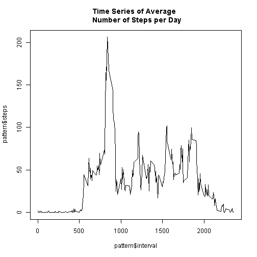

# Reproducible Research: Peer Assessment 1
This assignment makes use of data from a personal activity monitoring device.
This device collects data at 5 minute intervals through out the day. The data
consists of two months of data from an anonymous individual collected during
the months of October and November, 2012 and include the number of steps
taken in 5 minute intervals each day.

## Loading and preprocessing the data
The data file (activity.zip) was unzipped into the default directory.  The data file (activity.csv) was loaded with read.csv with no parameters.  

summary() revieled 2304 NAs.  

str() shows the dataset includes the following columns:  steps (int), date (Factor) and interval(int). 

For immediate analysis, NAs were removed, creating activeComplete. A day of the week was derived from the date using weekdays() to facilitate additional subsetting and analysis.


```r
setwd("C:\\Users\\srobin\\Documents\\GitHub\\RepData_PeerAssessment1")
unzip(paste0(getwd(),"\\","activity.zip"))
active <- read.csv(paste0(getwd(),"\\","activity.csv"))

summary(active)
```

```
##      steps               date          interval   
##  Min.   :  0.0   2012-10-01:  288   Min.   :   0  
##  1st Qu.:  0.0   2012-10-02:  288   1st Qu.: 589  
##  Median :  0.0   2012-10-03:  288   Median :1178  
##  Mean   : 37.4   2012-10-04:  288   Mean   :1178  
##  3rd Qu.: 12.0   2012-10-05:  288   3rd Qu.:1766  
##  Max.   :806.0   2012-10-06:  288   Max.   :2355  
##  NA's   :2304    (Other)   :15840
```

```r
str(active)
```

```
## 'data.frame':	17568 obs. of  3 variables:
##  $ steps   : int  NA NA NA NA NA NA NA NA NA NA ...
##  $ date    : Factor w/ 61 levels "2012-10-01","2012-10-02",..: 1 1 1 1 1 1 1 1 1 1 ...
##  $ interval: int  0 5 10 15 20 25 30 35 40 45 ...
```

```r
activeComplete <- active[complete.cases(active),]
activeComplete$dow <- weekdays(as.Date(activeComplete$date))
summary(activeComplete)
```

```
##      steps               date          interval        dow           
##  Min.   :  0.0   2012-10-02:  288   Min.   :   0   Length:15264      
##  1st Qu.:  0.0   2012-10-03:  288   1st Qu.: 589   Class :character  
##  Median :  0.0   2012-10-04:  288   Median :1178   Mode  :character  
##  Mean   : 37.4   2012-10-05:  288   Mean   :1178                     
##  3rd Qu.: 12.0   2012-10-06:  288   3rd Qu.:1766                     
##  Max.   :806.0   2012-10-07:  288   Max.   :2355                     
##                  (Other)   :13536
```


## What is mean total number of steps taken per day?

Complete cases was aggregated by date to derive 53 days of observations and summed for each day.  A histogram shows the frequency of the steps per day was around 10,000, closely matching a summary of this data, with a mean of 10,766 and a median of 10,765.

 


### Mean and Median  
- Mean: 1.0766 &times; 10<sup>4</sup>
- Median:  10765

## What is the average daily activity pattern?
Is there a 


```r
## time series plot of the average number of steps taken 
## (averaged across all days) versus the 5-minute intervals

daily <- activeComplete[,c(1,3)]
  pattern <- aggregate(.~ interval,data=daily, mean, na.rm=TRUE)
  plot(pattern$interval,pattern$steps, type="l", main="Time Series of Average \n Number of Steps per Day")
```

 


```r
## 5-minute interval that, on average, contains the maximum number of steps

  maxSteps <- subset(pattern, steps == max(pattern$steps))
  maxSteps
```

```
##     interval steps
## 104      835 206.2
```

The average daily activity show increasing activity at Interval 500 (5:00am) and a sharp spike around Interval 800 (8:00am).  Maximum activity occurs at Interval 835 (8:30am).  Activity fluxuates across the day, until around Interval 1900 (7:00pm), where it declines quickly and tappers off after 2000 (10:00pm).


## Inputing missing values

Where data was missing steps (NA), steps were estimated by using the mean of the corresponding interval and day of the week of records that had complete data.  A dataset of complete cases was created, along with Weekdays() function to create a 'Day-of-the-Week'column (dow). 

The dataset was grouped by interval + dow, creating a mean of each interval by day. Missing data is replaced day by day through a loop of missing dates.


```r
summary(replaceMissing)
```

```
##      steps               date          interval        dow           
##  Min.   :  0.0   2012-10-01:  288   Min.   :   0   Length:17568      
##  1st Qu.:  0.0   2012-10-02:  288   1st Qu.: 589   Class :character  
##  Median :  0.0   2012-10-03:  288   Median :1178   Mode  :character  
##  Mean   : 37.6   2012-10-04:  288   Mean   :1178                     
##  3rd Qu.: 19.0   2012-10-05:  288   3rd Qu.:1766                     
##  Max.   :806.0   2012-10-06:  288   Max.   :2355                     
##                  (Other)   :15840
```
The introduction of Replaced data has slightly raised the mean,   
- from 37.3826  
- to 37.5736

## Are there differences in activity patterns between weekdays and weekends?


```r
## histogram of the total number of steps taken each day after missing values were 
## imputed
perDay_after <- replaceMissing[,1:2]
sum_steps_per_Day_after <- aggregate(.~ date, data=perDay_after,sum)

hist(sum_steps_per_Day_after$steps, plot=TRUE, main="Histogram of Total Steps\n each Day After Missing Values are Input")
```

 

```r
# create a factor for Weekend - Weekend or Weekday
replaceMissing$weekend <- factor(ifelse(replaceMissing$dow %in% c("Saturday", "Sunday"), "Weekend", "Weekday"))

weekend <- subset(replaceMissing, replaceMissing$weekend == "Weekend")
weekday <- subset(replaceMissing, replaceMissing$weekend == "Weekday")


weekEnd <- aggregate(weekend$steps, 
                       by=list(inter=weekend$interval, 
                               we=weekend$weekend),
                       mean)

weekDay <- aggregate(weekday$steps, 
                       by=list(inter=weekday$interval, 
                               we=weekday$weekend),
                       mean)

# arrange by day of the week starting Monday
#dayofweek$day <- factor(dayofweek$Group.1, levels= c( "Monday", 
#    "Tuesday", "Wednesday", "Thursday", "Friday", "Saturday","Sunday"))
#dayofweek[order(dayofweek$day), ]


## panel plot comparing the average number of steps taken per 
## 5-minute interval across weekdays and weekends

library(ggplot2)
p1 <- ggplot(weekEnd, aes(x=inter,y=x)) + 
  geom_line() +
  labs(title="Weekend Pattern of Steps",y="Steps", x="Interval")
 

p2 <- ggplot(weekDay, aes(x=inter,y=x)) + 
  geom_line() +
  labs(title="Weekday Pattern of Steps", y="Steps", x="Interval")

# multiplot from R Cookbook
multiplot(p1, p2, cols=1)
```

 

[multiplot from R Cookbook](http://www.cookbook-r.com/Graphs/Multiple_graphs_on_one_page_(ggplot2)/)

